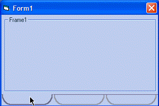



## a tabbed form \(the fast N cheesy way\)

### Description

this is a fast and simple way to implement a sort of tabbed form effect
 
### More Info
 

             |
---                |---
**Submitted On**   |2005-03-30 01:11:46
**By**             |[Evan Toder](https://github.com/Planet-Source-Code/PSCIndex/blob/master/ByAuthor/evan-toder.md)
**Level**          |Intermediate
**User Rating**    |5.0 (10 globes from 2 users)
**Compatibility**  |VB 4\.0 \(32\-bit\), VB 5\.0, VB 6\.0
**Category**       |[Coding Standards](https://github.com/Planet-Source-Code/PSCIndex/blob/master/ByCategory/coding-standards__1-43.md)
**World**          |[Visual Basic](https://github.com/Planet-Source-Code/PSCIndex/blob/master/ByWorld/visual-basic.md)
**Archive File**   |[a\_tabbed\_f1869523302005\.zip](https://github.com/Planet-Source-Code/evan-toder-a-tabbed-form-the-fast-n-cheesy-way__1-59718/archive/master.zip)

